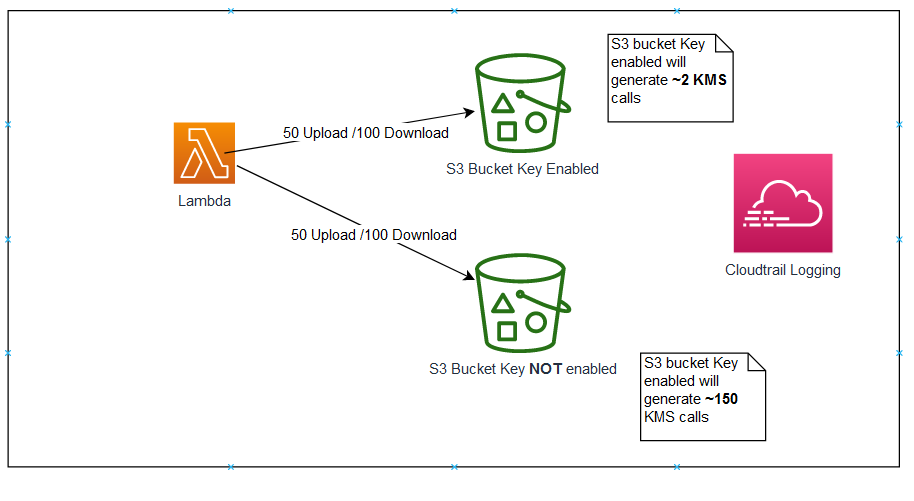
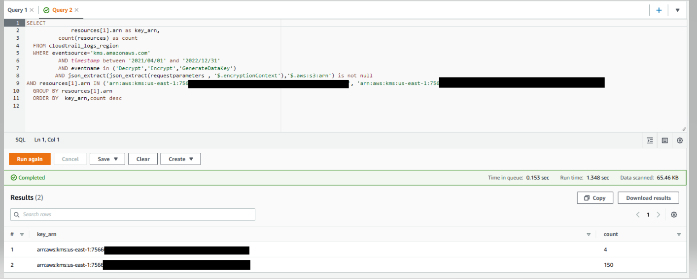

# Amazon S3 Bucket Key Proof of concept

[S3 Bucket Key](https://docs.aws.amazon.com/AmazonS3/latest/userguide/bucket-key.html) Proof of concept (POC) will demonstrate how request traffic decreases (up to 99%) from Amazon S3 to AWS KMS when you enable the S3 Bucket Key.

Amazon S3 Bucket Keys reduce the cost of Amazon S3 server-side encryption using AWS Key Management Service (SSE-KMS). This new bucket-level key for SSE can reduce AWS KMS request costs by up to 99 percent by decreasing the request traffic from Amazon S3 to AWS KMS. 

# Setup to run POC

- Follow the [Instruction Setup Guide](setup/S3BucketKeyPOC_Instruction.pdf) 

# Workflow
- Cloudformation template will create all the necessary required infrastructure as demonstrated in the architecture diagram below. It will create two S3 Buckets. Each bucket is encrypted with SSE-KMS with unique KMS key. First Bucket with Bucket Key Disabled while Second Bucket with S3 Bucket Key Enabled. It will also create Lambda function to generate the traffic in both of these buckets.
- Once the cloudformation template creates the infrastructure, you run the lambda function to generate the traffic. Lambda function uploades 50 files and downloading 100 files to both of these S3 buckets. Once the traffic is generated then you can analyze the count of KMS API call for each unique KMS Key from Amazon S3 to AWS KMS using CloudTrail and Amazon Athena as [Instruction Setup Guide ](setup/S3BucketKeyPOC_Instruction.pdf).
- You will observe KMS key with S3 Bucket Key Enabled makes significantly less KMS API calls (up to 99% less).
 

# Architecture

  

# Sample POC results
#### Result of POC demonstrate that by uploading 50 file objects and by downloading 100 files objects on both SSE-KMS encrypted bucket,Bucket Key enabled bucket has 97.33% lower KMS API Calls. 

S3 Bucket with Bucket Key Enabled made Only 4 KMS API calls 
S3 Bucket with Bucket Key Disabled made 150 KMS API calls
 

In this example there is 97.33% reduction in KMS API calls.

  

``
# License

This library is licensed under the MIT-0 License. See the LICENSE file.