# S3 Bucket Key POC Setup Instruction Guide
## Phase 1: Create the Infrastructure Using CloudFormation template
### 1. Clone the Repository
 Clone the **s3-bucketkey-poc** github repository to your computer using the following command 
 ```
 git clone https://github.com/aws-samples/s3-bucketkey-poc
 ```
### 2. Run the Cloud Formation Stack 
-  Login to AWS console 
-  Go to CloudFormation
-  Create Stack 
-  Chose the downloaded cfn_s3_bucket_key_poc.json file as shown in diagram below.
<p align="center">
  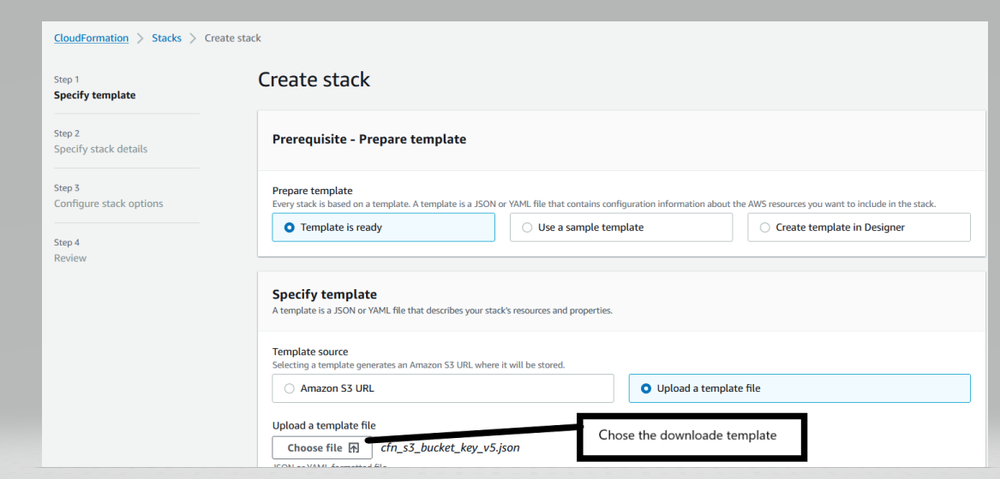

### 3. Specify the S3 Buckets 
 Specify Stack Details: Enter the Stack Name and Bucket Names and click Next. Please note: CFN template will create two buckets. First bucket with S3 Bucket Keys DISABLED and Second Bucket with S3 Bucket Keys ENABLED. 

 <p align="center">
  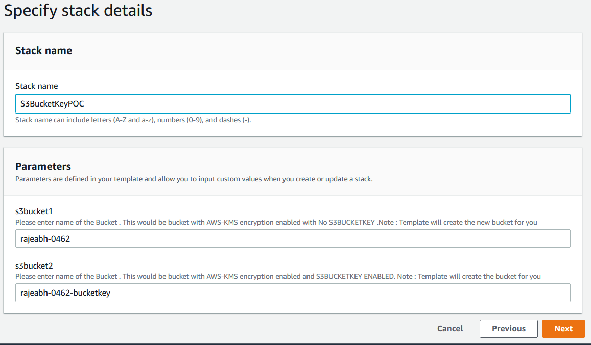

### 4. Skip Advance Option
You don’t need to change anything, just need to click Next 
<p align="center">
  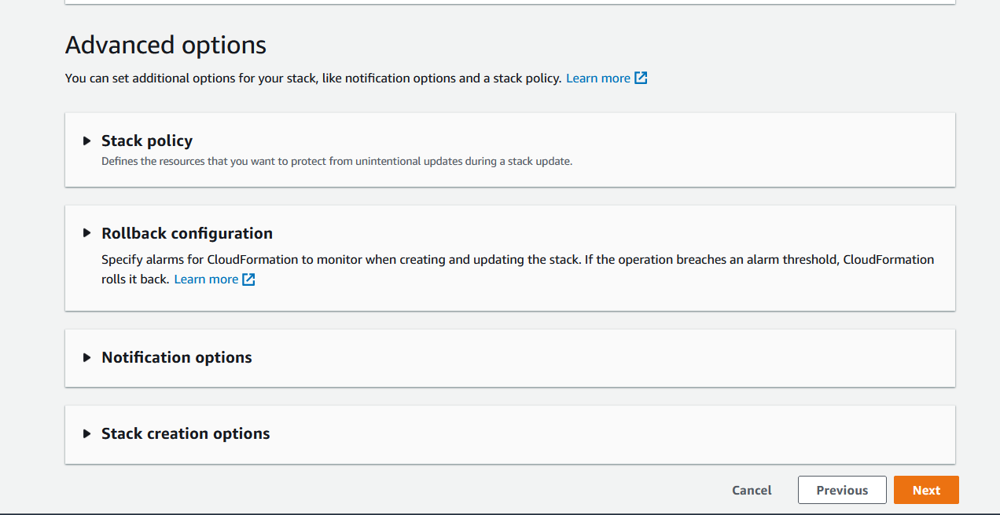

### 5. Create the Stack
Review the stack and acknowledge that CFN template is creating IAM role.
<p align="center">
  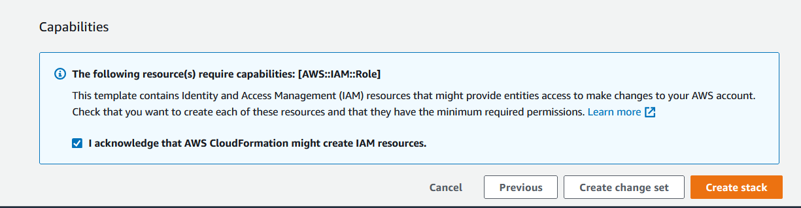

### 6. Note down the stack output values
Please note that values for **KMSKeyARN1** and **KMSKeyARN2** these values required in Athena query to analyze the KMS traffic
<p align="center">
  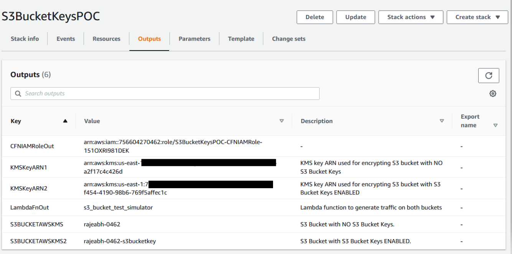

### 7. Verify S3 Buckets for S3 Bucket Key setting 
- Go to First S3 Bucket
- Click on Properties 
- Default Encryption
Observe S3 Bucket Key is **Disabled** as shown in diagram below
<p align="center">
  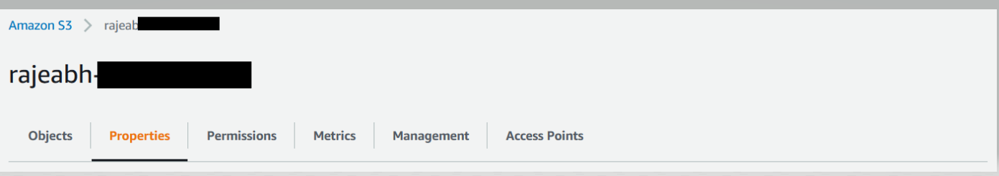

<p align="center">
  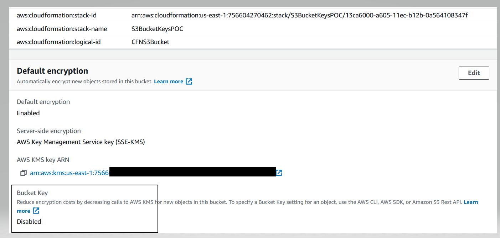

- Go to Second S3 Bucket 
- Click on Properties 
- Default Encryption
Observe S3 Bucket Key is **Enabled** as shown in diagram below

<p align="center">
  

<p align="center">
  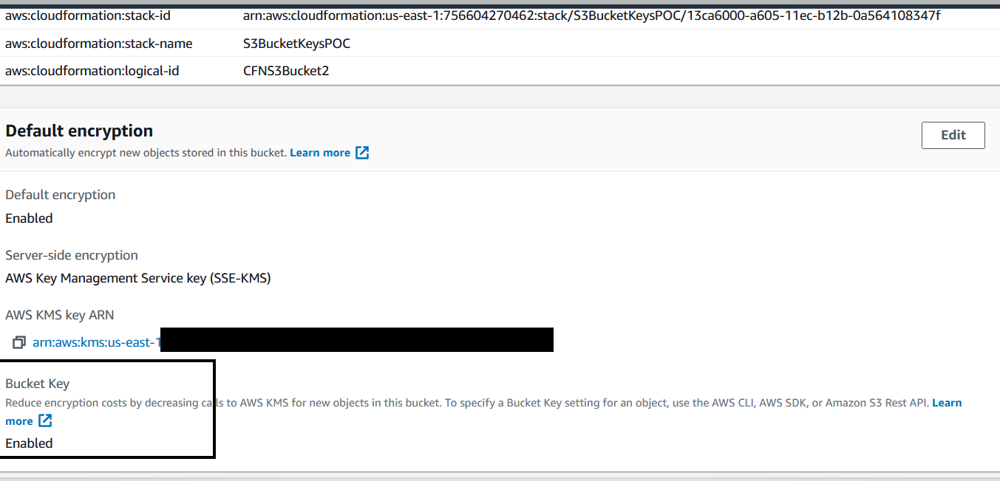

## Phase 2: Generate and analyze the S3 to AWS-KMS traffic
Now we have created all the Infrastructure we will enable the CloudTrail and Amazon Athena. Generate the traffic to both the S3 Buckets using Lambda function and Analyze the KMS API calls using Athena.

### 8. Enable AWS CloudTrail 
AWS CloudTrail is a service that enables governance, compliance, operational auditing, and risk auditing of your AWS account. With AWS CloudTrail, you can log, continuously monitor, and retain account activity related to actions across your AWS. If you have already enabled CloudTrail, you can reuse the same. If CloudTrail is not enabled, you can enable CloudTrail as mentioned in the [tutorial here](https://docs.aws.amazon.com/awsCloudTrail/latest/userguide/CloudTrail-tutorial.html#tutorial-step2).
Please note, for the proposed solution you need to enable CloudTrail for **management events only**. You don’t need to enable CloudTrail for data events or insight events. Also, **please note that we need only single cloud trail and creating duplicate cloud trails can increase the cost**. 

Please see the [CloudTrail pricing:](https://aws.amazon.com/CloudTrail/pricing/).
 
Please note that you can analyze the data in Athena only when the Cloudtrail data is available. it takes up to 15 minutes for events to get to CloudTrail, and up to 5 minutes for CloudTrail to write to S3
### 9. Create Amazon Athena table to query the CloudTrail data 
Amazon Athena is an interactive query service that makes it easy to analyze data in Amazon S3 using standard SQL. Amazon Athena is Serverless, so there is no infrastructure to manage, and you pay only for the queries that you run.
Create Amazon Athena table in any database or default database in a region where your hub account S3 Data Lake bucket resides.
If you are using Athena first time [follow the steps](https://docs.aws.amazon.com/athena/latest/ug/getting-started.html) below to create database. 

Open the Athena built-in query editor, copy below query, modify as suggested below, and run the query.
-	In the LOCATION and storage.location.template clauses, 
-	replace the **bucket** with **CloudTrail Bucket**, 
-	**account-id** with your  account’s **account ID**,
-	and **aws-region** with region where CloudTrail bucket is located.
-	For projection.timestamp.range, **replace 2020/01/01** with the starting date that you want to use . 

After successful execution of the query, you will see the CloudTrail_logs table created in Athena.
```
CREATE EXTERNAL TABLE cloudtrail_logs_region(
    eventVersion STRING,
    userIdentity STRUCT<
        type: STRING,
        principalId: STRING,
        arn: STRING,
        accountId: STRING,
        invokedBy: STRING,
        accessKeyId: STRING,
        userName: STRING,
        sessionContext: STRUCT<
            attributes: STRUCT<
                mfaAuthenticated: STRING,
                creationDate: STRING>,
            sessionIssuer: STRUCT<
                type: STRING,
                principalId: STRING,
                arn: STRING,
                accountId: STRING,
                userName: STRING>>>,
    eventTime STRING,
    eventSource STRING,
    eventName STRING,
    awsRegion STRING,
    sourceIpAddress STRING,
    userAgent STRING,
    errorCode STRING,
    errorMessage STRING,
    requestParameters STRING,
    responseElements STRING,
    additionalEventData STRING,
    requestId STRING,
    eventId STRING,
    readOnly STRING,
    resources ARRAY<STRUCT<
        arn: STRING,
        accountId: STRING,
        type: STRING>>,
    eventType STRING,
    apiVersion STRING,
    recipientAccountId STRING,
    serviceEventDetails STRING,
    sharedEventID STRING,
    vpcEndpointId STRING
  )
PARTITIONED BY (
   `timestamp` string)
ROW FORMAT SERDE 'com.amazon.emr.hive.serde.CloudTrailSerde'
STORED AS INPUTFORMAT 'com.amazon.emr.cloudtrail.CloudTrailInputFormat'
OUTPUTFORMAT 'org.apache.hadoop.hive.ql.io.HiveIgnoreKeyTextOutputFormat'
LOCATION
  's3://<bucket>/AWSLogs/<account-id>/CloudTrail/<aws-region>'
TBLPROPERTIES (
  'projection.enabled'='true', 
  'projection.timestamp.format'='yyyy/MM/dd', 
  'projection.timestamp.interval'='1', 
  'projection.timestamp.interval.unit'='DAYS', 
  'projection.timestamp.range'='2020/01/01,NOW', 
  'projection.timestamp.type'='date', 
  'storage.location.template'='s3://<bucket>/AWSLogs/<account-id>/CloudTrail/<aws-region>/${timestamp}')
```
### 10. Run the Lambda function to generate the traffic to S3 Bucket which intern will generate KMS API calls.
Go to Cloudformation --> Stacks--> Select S3 Bucket Key POC stack--> Resource--> Lambda function

<p align="center">
  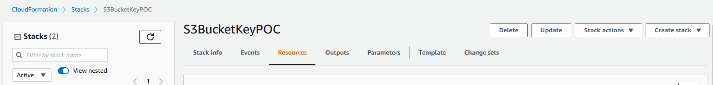

- Click on Lambda function

<p align="center">
  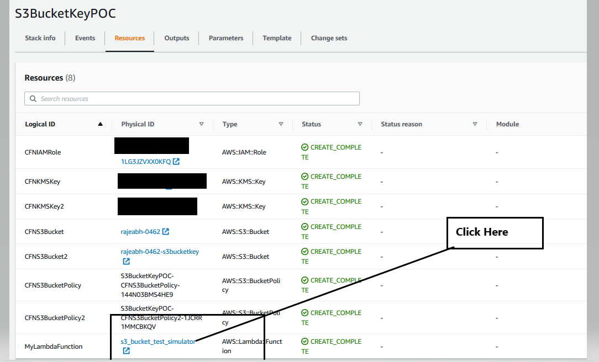

- Run the s3_bucket_test_simulator Lambda function 
Create test event and run the lambda function

<p align="center">
  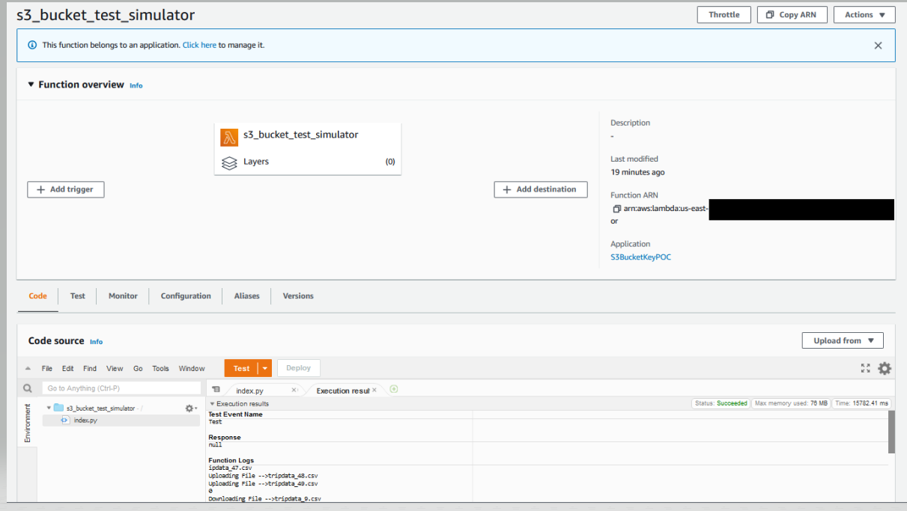


Once you run the lambda function you will see traffic generated on S3 Buckets. You will 50 test files are uploaded in both these S3 Buckets.

<p align="center">
  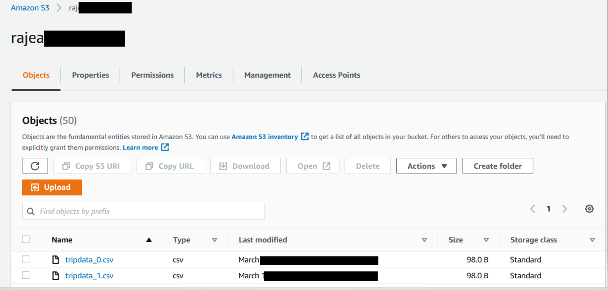

### 11. See the difference of KMS API call reduction when S3 bucket Key is ENABLED.
Go to Athena query Editor and run the following query. Replace **KMSKeyARN1-Value** and **KMSKeyARN2-value** generated from Cloud formation template. Change the timestamp between as dates as appropriate
```
SELECT 
              resources[1].arn as key_arn,        
          count(resources) as count
  FROM cloudtrail_logs_region
  WHERE eventsource='kms.amazonaws.com'
          AND timestamp between '2021/04/01' and '2022/12/31'
          AND eventname in ('Decrypt','Encrypt','GenerateDataKey')
         AND json_extract(json_extract(requestparameters , '$.encryptionContext'),'$.aws:s3:arn') is not null 
AND resources[1].arn IN (KMSKeyARN1-Value ',’ KMSKeyARN2-value’)
  GROUP BY resources[1].arn
  ORDER BY  key_arn,count desc
```
**Result Show demonstrate that by uploading 50 file objects and by downloading 100 files objects on both SSE-KMS encrypted bucket**

- S3 Bucket with Bucket Key Enabled made **4 KMS API** calls 
- S3 Bucket with Bucket Key Disabled has **150 KMS API** calls

In this example result shows there is **97.33%** reduction in KMS API calls with use of S3 Bucket Key.

<p align="center">
  

## Phase 3: Clean Up 
### 1. Empty S3 Buckets 
Empty both the S3 buckets that were created as part of Step-3
1.	Sign in to the AWS Management Console and open the Amazon S3 console at https://console.aws.amazon.com/s3/
2.	In the Bucket name list, select the option next to bucket name (that you entered as part of Step 3) and then choose Empty.
3.	On the Empty bucket page, confirm that you want to empty the bucket by entering the bucket name into the text field, and then choose Empty.
4.	Monitor the progress of the bucket emptying process on the Empty bucket: Status page.
5.	Follow 1-4 for other S3 bucket

###	 2. Delete the Cloudformation Stack 
1.	Open the AWS CloudFormation console at https://console.aws.amazon.com/cloudformation
2.	On the Stacks page in the CloudFormation console, select the stack S3BucketKeyPOC to delete. 
3.	In the stack details pane, choose Delete.
4.	Select Delete stack when prompted.
###	 3. Delete the CloudTrail created 
If you have created CloudTrail specifically for this solution, you can delete the CloudTrail by following the instructions [provided here](.
https://docs.aws.amazon.com/awsCloudTrail/latest/userguide/CloudTrail-delete-trails-console.html)
###	 4. Drop the Amazon Athena table
1.	Log in to the Amazon Athena console and run the following drop table query: 
2.	Drop table < CloudTrail_logs_aws_region>


